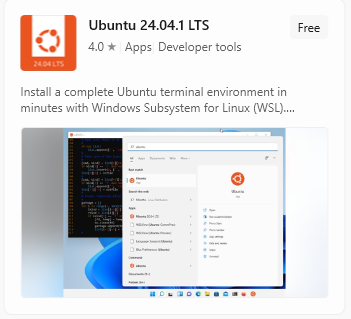

# Simple training exercises in Geant4

source /snap/gate/45/usr/local/bin/geant4.sh

Installations required:  
- OS: Ubuntu or WSL2 on Windows 10 or 11 with Ubuntu flavour
    - `https://learn.microsoft.com/en-us/windows/wsl/install` (install only WSL2 please)
    - After installing WSL2, go to Windows store and search for WSL and from the list choose Ubuntu 24.04.1 LTS  
    - 
    - Once installed Ubuntu terminal can be started any other app on Windows.
- VSCode 
    - If you using WSL2, you have to install this on Windows and not inside Ubuntu 
- Jupyter extension (on VSCode)
- To install Geant4 you can use snap package manager:
    - `sudo apt update`
    - `sudo apt install snapd` 
    - `sudo snap install gate`

All codes contain a README.md file and a analysis.py code to get started with the analysis.

For running examples, create a build folder inside the respective folders. Inside the build folder call `cmake ../` and then `make`. On successful compilation, you can run the examples by calling `./exampleB1`. 

Make sure you run `make` if you make any changes to the code or mac files.

