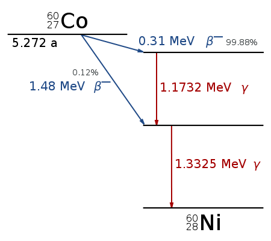

## Beta-gamma decay

A simple Co60 source kept at the centre with a sphere of inner radius 0.999 cm and outer radius 1 cm surrounding it, working as a detector.

Note the physics list!

### Activities

a. Observe particles come out of the scattering:  
The PDG particle codes are here: https://pdg.lbl.gov/2007/reviews/montecarlorpp.pdf

c. What is the proportion of these particles and what is it that you expected?

d. Plot the energy spectrum and identify the photopeak and beta spectrum

d. What is end-point energy of the beta particles?

